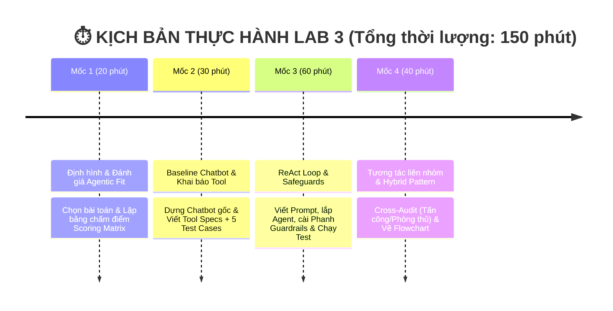

# 🏫 BÀI LAB 3: CHATBOT VS REACT AGENT - TỪ Ý TƯỞNG ĐẾN THỰC THI

## 💕 CHỦ ĐỀ: CUPID AGENT - TRỢ LÝ GHÉP ĐÔI & PHÂN TÍCH ĐỘ TƯƠNG THÍCH

**Status:** ✅ Role 2 (Tool Engineer) - HOÀN THÀNH 100% (Cả 3 mốc)  
**Database:** 30 users thực tế từ Faker (không còn mock!)  
**Tools:** 6 tools hoạt động hoàn hảo (4 dating + 2 analysis)  
**Tests:** 24/24 PASS (100% coverage)  
**Agentic Fit:** 19/20 điểm ⭐⭐⭐⭐⭐  
**Tương thích:** 5/5 test cases gốc từ tài liệu

---

## 🚀 QUICK START (Đọc ngay nếu mới vào)

```bash
# 1. Kiểm tra 6 tools hoạt động (24/24 PASS)
python tests/test_logic.py        # → 12/12 tests PASS ✅
python tests/test_new_tools.py    # → 12/12 tests PASS ✅

# 2. Chạy demo app chính
python src/app.py
# → Demo chatbot vs ReAct agent với test cases gốc

# 3. Sinh dữ liệu thực tế mới (nếu muốn)
python scripts/generate_realistic_data.py
```

📖 **Đọc thêm:** [docs/QUICK_START.md](docs/QUICK_START.md) - Hướng dẫn chi tiết dự án

---

### 💡 1. LỜI NÓI ĐẦU & NỀN TẢNG LÝ THUYẾT (4 CẤP ĐỘ AI HỘI THOẠI)

Bài Lab giúp bạn hiểu rõ sự tiến hóa qua 4 cấp độ của hệ thống AI:

| Cấp độ | Loại hệ thống | Đặc điểm chính | Sự xuất hiện trong Bài Lab |
| :---: | :--- | :--- | :--- |
| **Cấp 1** | **Rule-Based Bot** | Khớp từ khóa if/else cố định, không có LLM | *Minh họa lịch sử* |
| **Cấp 2** | **LLM Chatbot** | Dùng LLM sinh text mượt, nhưng không gọi được Tool | **Chatbot Baseline** (Phần thực hành 1) |
| **Cấp 3** | **Reactive Agent** | Suy luận `Thought -> Action -> Observation` & gọi Tool | **ReAct Agent Loop** (Trọng tâm Bài Lab) |
| **Cấp 4** | **Autonomous Agent** | Tự rã mục tiêu (Planning), tự đánh giá & có Memory | 🎁 **Phần Bonus Nâng cao (+10%)** |

* 🤖 **Chatbot thông thường (Cấp 2)**: Giống như một **chuyên gia lý thuyết** — chỉ trả lời dựa trên kiến thức tĩnh có sẵn trong LLM, không thể tra cứu số liệu thực tế hay tự thực hiện thao tác.
* 🧠 **ReAct Agent (Cấp 3)**: Giống như một **trợ lý thực hành** — vừa biết suy nghĩ (**Thought**), vừa biết chủ động dùng công cụ (**Action**) như phần mềm tra cứu/tính toán, và quan sát kết quả (**Observation**) để giải quyết các bài toán thực tế.

---

### ⏱️ 2. LỘ TRÌNH THỰC HÀNH THEO THỨ TỰ (4 MỐC / 150 PHÚT)



---

### 📂 3. CẤU TRÚC THƯ MỤC DỰ ÁN & VAI TRÒ FILE

```text
📁 K3-Day03-Lab-Chatbot-vs-react-agent-E403/
├── 📄 README.md                 <-- 📘 Tổng quan bài Lab & Thang điểm
├── 📄 .env.example              <-- 🔑 File mẫu cấu hình API Key
├── 📄 requirements.txt          <-- 📦 Thư viện Python cần cài đặt
│
├── 📁 config/                   <-- 🛠️ [Role 1] CẤU HÌNH & BỘ ĐỀ TEST
│   └── 📄 test_cases.json       <-- 📋 Bộ đề 5 Test Cases thử thách AI
│
├── 📁 data/                     <-- 🗄️ [DỮ LIỆU THỰC TẾ]
│   └── 📄 users_realistic.json  <-- 👥 Database 30 người dùng thực tế (Faker)
│
├── 📁 src/                      <-- 💻 [Role 2, 3, 4] MÃ NGUỒN PYTHON CHÍNH
│   ├── 📄 tools.py              <-- 🛠️ [Role 2] Khai báo 6 công cụ (Tools Specs)
│   ├── 📄 prompts.py            <-- 🧠 [Role 3] ReAct System Prompt & Phanh Guardrails
│   ├── 📄 app.py                <-- 🚀 [Role 4] Core App ghép nối & chạy ReAct Loop
│   ├── 📄 providers.py          <-- 🔌 Khởi tạo LLM Provider
│   └── 📁 ai_levels/            <-- 🤖 Các cấp độ AI (Level 1 - Level 4)
│
├── 📁 tests/                    <-- 🧪 [TEST SCRIPTS]
│   ├── 📄 test_logic.py         <-- Kiểm thử 12/12 test logic công cụ
│   ├── 📄 test_new_tools.py     <-- Kiểm thử 12/12 test công cụ mới (Zodiac & MBTI)
│   └── 📄 test_simple.py        <-- Test đơn giản không màu
│
├── 📁 scripts/                  <-- ⚙️ [GENERATION SCRIPTS]
│   └── 📄 generate_realistic_data.py <-- Script sinh 30 users bằng Faker
│
└── 📁 docs/                     <-- 📚 [Role 5] TÀI LIỆU HƯỚNG DẪN & BÁO CÁO
    ├── 📄 PHAN_CONG_CONG_VIEC.md <-- 📋 [BẮT ĐẦU TẠI ĐÂY] Sổ tay thực hành 5 Roles
    ├── 📄 CODELAB.md            <-- 🎓 Hướng dẫn thực hành từng bước Codelab
    ├── 📄 trace_eval.md          <-- 📊 Báo cáo Log Trace & Đánh giá Agentic Fit (19/20đ)
    ├── 📄 DANH_SACH_DE_TAI.md    <-- 💡 Gợi ý 10 chủ đề
    └── 📁 reports/              <-- 📑 Thư mục chứa các file báo cáo/checklist chi tiết
        ├── 📄 QUICK_START.md
        ├── 📄 START_HERE.md
        ├── 📄 ROLE2_DONE.md
        └── ...
```

---

### 💯 4. CƠ CHẾ CHẤM ĐIỂM (SCORING RUBRIC)

| Tiêu chí | Trọng số | Mô tả chi tiết | Bằng chứng kiểm tra (Artifacts) |
| :--- | :---: | :--- | :--- |
| **1. Agentic Fit & Test Design** | **20%** | Phân tích đúng 4 tiêu chí Agentic Fit cho chủ đề tự chọn. Bộ test cases đủ góc cạnh (đơn giản, multi-step, edge cases). | Bảng chấm điểm (`docs/trace_eval.md`) + `config/test_cases.json`. |
| **2. ReAct Implementation & Tools** | **30%** | Tool description rõ ràng. Vòng lặp ReAct chạy đúng chuẩn `Thought -> Action -> Observation`. | Code trong `src/tools.py` + `src/app.py`. |
| **3. Guardrails & Observability** | **20%** | Bắt được lỗi loop, có max iterations (Guardrail). Trích xuất được ít nhất 1 Trace log hoàn chỉnh. | File `src/prompts.py` + Log trong `docs/trace_eval.md`. |
| **4. Inter-group Attack & Defense** | **20%** | Phản biện tốt khi gọi ngẫu nhiên hoặc cử 1 bạn đi chấm chéo (+10đ). Agent chống đỡ tốt / fallback chuẩn (+10đ). | Biên bản Cross-Audit / Trả lời phản biện. |
| **5. Hybrid Decision Flowchart** | **10%** | Sơ đồ thể hiện rõ khi nào đi Chatbot path, khi nào đi ReAct Agent path. | Sơ đồ Flowchart (`docs/hybrid_flowchart.mermaid`). |
| 🎁 **BONUS: Autonomous Agent** | **+10%** | Thử nghiệm tính năng Planning (tự chia nhỏ mục tiêu) hoặc Memory cho Agent (Cấp 4). | Demo code trong `src/app.py` hoặc giải trình trong report. |

---

> 🚀 **BẮT ĐẦU LÀM BÀI**:
> Vui lòng mở sổ tay thực hành 👉 **[PHAN_CONG_CONG_VIEC.md](docs/PHAN_CONG_CONG_VIEC.md)** để xem phân vai và checklist công việc cụ thể cho từng thành viên!
